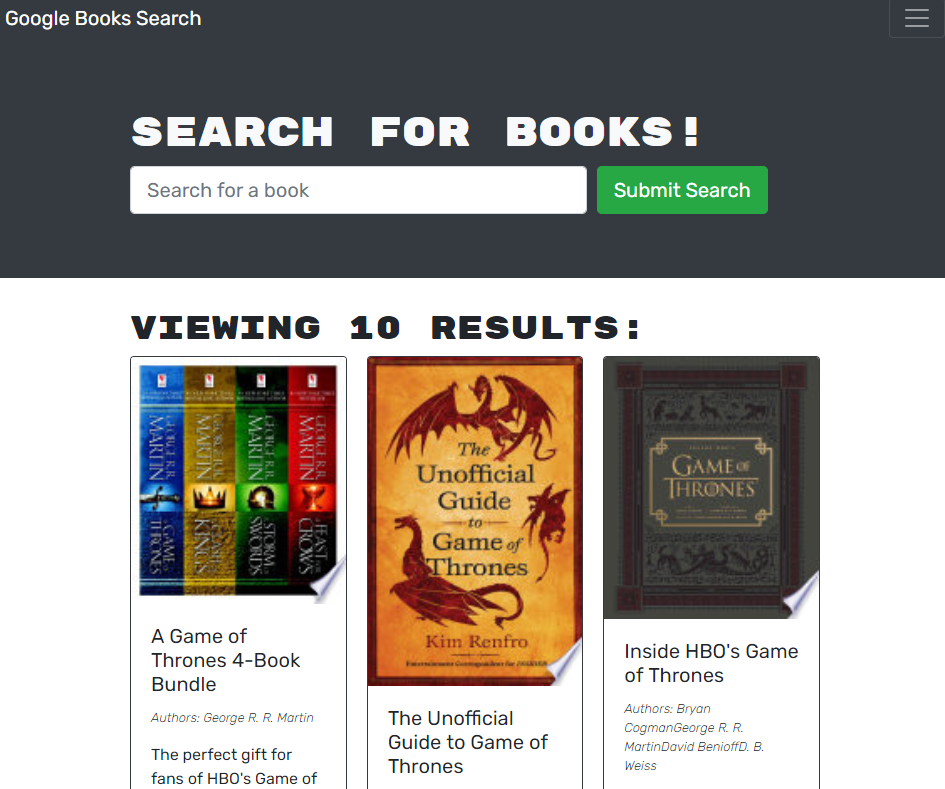
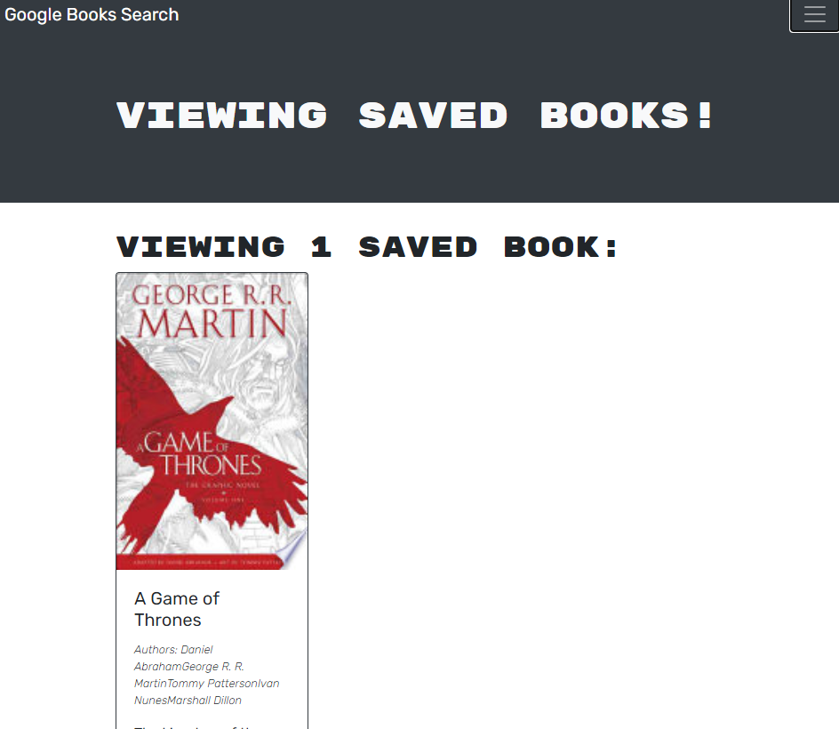

# Book Search Engine
## Table of Contents
* [Project Description](#project-description)
* [Installation](#installation)
* [Questions](#questions)

## Screenshots

## Project Description
This is book search engine using Google Books API. You can also save books that you would like to read or buy and delete them when you are finished with them. This was an assignment for bootcamp. We were tasked with refactoring this working app from using a traditional RestAPI to GraphQL using Apollo Client.

## Installation
This is a website application: please go to this [link](https://book-search-camp-assignment.herokuapp.com/)
## Questions
* Please visit my [GitHub Profile](https://github.com/dalyd14)